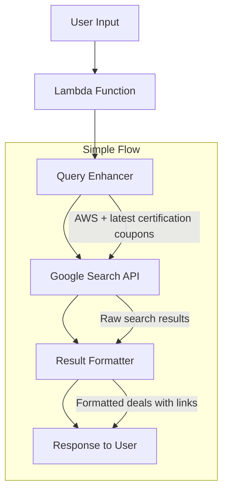

# Design Document

## Overview

This design simplifies the integration of Google Search API into the existing certification deals hunter application. Instead of complex scraping logic, the system will take user queries (or provider names) and enhance them with search terms like "latest certification coupons discount 2025" before sending to Google Search API. The results are then formatted and presented with source links.

## Architecture

### Simplified Architecture



## Components and Interfaces

### 1. Query Enhancer

**Purpose:** Takes user input and adds search optimization terms

**Simple Logic:**
```python
def enhance_query(user_input):
    base_query = user_input or "certification deals"
    enhanced = f"{base_query} latest certification coupons discounts or active get certified challenges in past month and valid till end of the year or lesser or greater"
    return enhanced
```

### 2. Google Search Integration

**Purpose:** Simple API call to Google Custom Search

**Basic Implementation:**
```python
def search_google(query):
    url = f"https://www.googleapis.com/customsearch/v1"
    params = {
        'key': GOOGLE_API_KEY,
        'cx': SEARCH_ENGINE_ID,
        'q': query,
        'num': 10
    }
    response = requests.get(url, params=params)
    return response.json()
```

### 3. Result Formatter

**Purpose:** Convert Google search results to deal format

**Simple Parsing:**
```python
def format_search_results(search_results):
    deals = []
    for item in search_results.get('items', []):
        deal = {
            'title': item['title'],
            'snippet': item['snippet'],
            'link': item['link'],
            'provider': extract_provider(item['title']),
            'discovered_at': datetime.now().isoformat()
        }
        deals.append(deal)
    return deals
```

## Data Models

### Simplified Deal Object

```python
deal = {
    'offer_id': f"google_{timestamp}",
    'provider': extracted_provider,
    'title': search_result['title'],
    'snippet': search_result['snippet'], 
    'source_url': search_result['link'],
    'discovered_at': datetime.now().isoformat(),
    'search_query': original_query
}
```

## Error Handling

### Simple Error Management

```python
def search_with_fallback(query):
    try:
        return search_google(query)
    except Exception as e:
        print(f"Google Search failed: {e}")
        return fallback_to_current_scraping()
```

## Testing Strategy

### Simple Tests

1. **API Integration Test**
   - Test Google Search API call with sample query
   - Verify response format
   - Test error handling

2. **Query Enhancement Test**
   - Test query building with different inputs
   - Verify enhanced queries include current year

3. **Result Formatting Test**
   - Test conversion of search results to deal format
   - Verify all required fields are present

## Configuration

### Environment Variables

```bash
# Google Search API Configuration (add to .env)
GOOGLE_SEARCH_API_KEY=your_api_key_here
GOOGLE_SEARCH_ENGINE_ID=your_search_engine_id

# Existing configuration remains unchanged
AWS_ACCOUNT_ID=your_account_id
BEDROCK_MODEL_ID=anthropic.claude-3-sonnet-20240229-v1:0
```

## Implementation Flow

### For Main Agent
1. User selects provider (AWS, Azure, etc.) or enters custom query
2. System enhances query: `"{user_input} latest certification coupons discount voucher"`
3. Call Google Search API
4. Format results and display with source links

### For Chat Agent  
1. User asks: "Find me AWS deals" 
2. System enhances: "AWS latest certification coupons discount vouchers"
3. Call Google Search API
4. Return formatted response with links

This simplified approach focuses on the core functionality - taking user input, enhancing it for better search results, and presenting the findings with source verification.